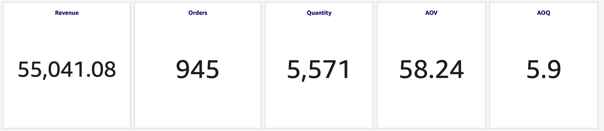
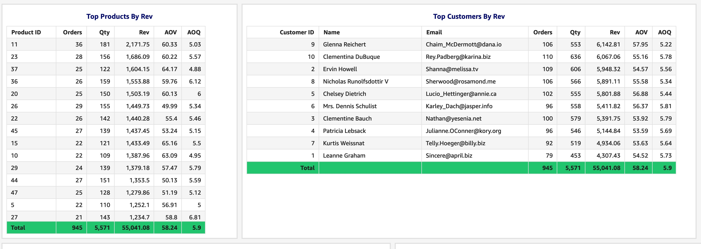
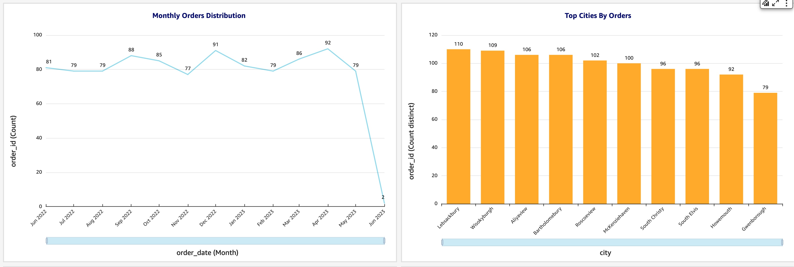
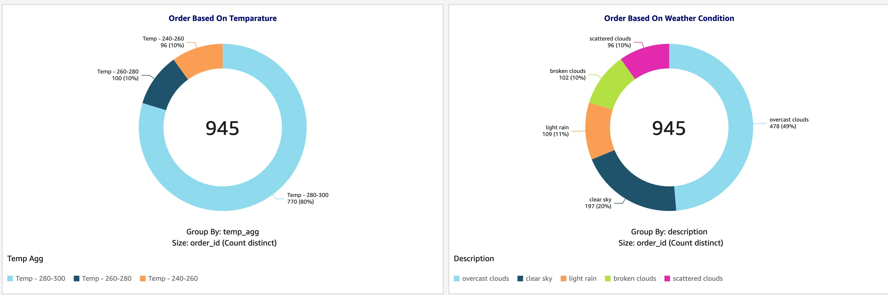

## Introduction
This README provides comprehensive information about the ETL (Extract, Transform, Load) project, including details on project structure, files, data sources, APIs, credentials, destination, and analysis scripts.

## Project Overview
The ETL project involves extracting data from various sources, transforming it, and loading it into AWS Redshift. This process facilitates data analysis and insights generation.

## Project Components
### Python Files
* sales_order.py: Python script for extracting and processing sales data from a CSV file.
* customer_and_weather.py: Python script for extracting customer data from the JSONPlaceholder API and weather data from the OpenWeatherMap API.
## ETL Sources
* Sales Data: CSV file containing sales information.
* Customer Data: Retrieved from the JSONPlaceholder API.
* Weather Data: Retrieved from the OpenWeatherMap API. An API key is required, stored in cred.json.
## Destination
* Data is loaded into AWS Redshift for storage and analysis. AWS credentials, including Redshift credentials, are stored securely in AWS Secret Manager.

## Data Modeling & Schema Design
* Star Schema would be good choice for given use cased.
* Fact table - saels order
  * Primary Key - order_id,
  * Foreign_key - customer_id
* Dimenstion Table - Customer Details & Weather Details
  * Customer Details (Primary Key) - Customer ID
  * Customer Details (Foreign Key) - lat, lon
  * Weather Details (composite Key) - lat, lon, weather_time
* Please refer create_table.sql for DDL. 

## SQL Files
* create_table.py: SQL script for creating tables, including staging area tables, in Redshift.
* analysis.sql: SQL script containing queries for analysis and insights generation.
## Folders
* sql_file: Contains SQL scripts for table creation and analysis.
* log: Stores log files generated during the ETL process.
* data: Stores extracted data from sources.
* Analysis: Contains images of analysis results.

## Setup
* Ensure Python environment is set up.
* Create virtual environment using " python3 -m virtualenv venv "
* Activate virtual environment using " . vevn/bin/activate "
* Install all necessary packages using command " pip install -r requirements.txt"
* Get your all credential into cred.json
* Obtain API keys for accessing the OpenWeatherMap API.
* Store API keys and other credentials securely in cred.json.
* Ensure AWS credentials are stored securely in AWS Secret Manager.
* Configure Redshift connection details in create_table.py. (Credential will be taken automatically from cred.json) 
* Run create_table.py to set up tables in Redshift.
* Execute ETL scripts (sales_order.py and customer_and_weather.py) to extract, transform, and load data.
* Run analysis queries from analysis.sql on the loaded data in Redshift to generate insights.

## Analysis

## Contact
You can reach me at amitjiit89@gmail.com. For any further assistance, refer to the contact information provided.

